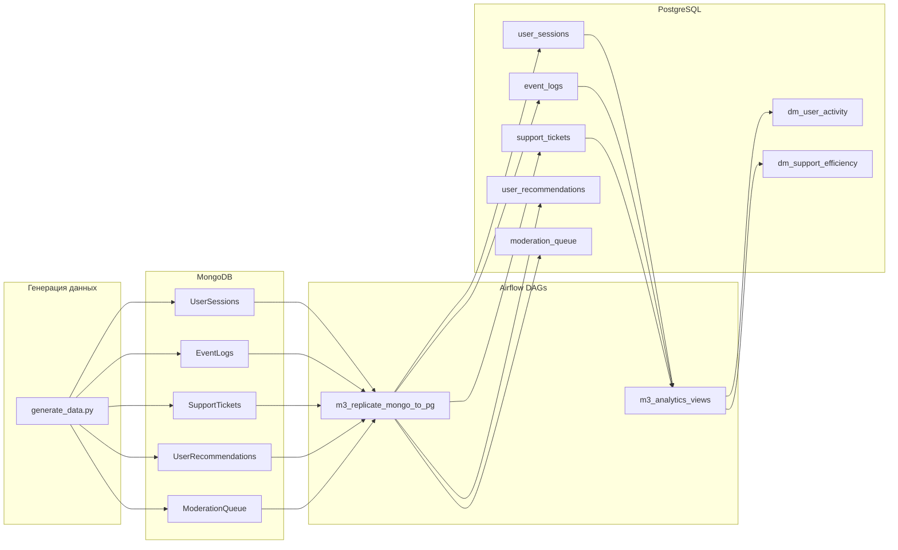

# Итоговое задание модуля 3: ETL MongoDB → PostgreSQL с Apache Airflow

## Описание проекта

Проект реализует полный ETL-процесс:

1. **Генерация данных** — заполнение нереляционной базы MongoDB тестовыми данными (5 коллекций).
2. **Репликация с трансформацией** — перенос данных из MongoDB в реляционную базу PostgreSQL через Airflow с очисткой и преобразованием.
3. **Аналитические витрины** — построение двух агрегированных витрин в PostgreSQL для бизнес-анализа.

## Архитектура



## Стек технологий

| Компонент | Версия |
|-----------|--------|
| Apache Airflow | 2.9.3 |
| PostgreSQL | 13 |
| MongoDB | 7 |
| Python | 3.12 (в образе Airflow) |
| pandas | последняя |
| pymongo | последняя |

## Структура файлов

```
Module-3-final/
├── docker-compose.yaml          — Docker-стек (Airflow + PostgreSQL + MongoDB)
├── README.md                    — документация (этот файл)
├── scripts/
│   └── generate_data.py         — скрипт генерации данных в MongoDB
├── dags/
│   ├── generate_data_dag.py     — DAG: генерация данных
│   ├── replicate_mongo_to_pg_dag.py — DAG: репликация с трансформациями
│   └── analytics_views_dag.py   — DAG: аналитические витрины
├── logs/                        — логи Airflow (создаётся автоматически)
└── plugins/                     — плагины Airflow (пусто)
```

## Инструкция по запуску

### 1. Запуск инфраструктуры

```bash
cd Module-3-final
docker-compose up -d
```

Дождитесь, пока все сервисы запустятся (1–2 минуты). Веб-интерфейс Airflow доступен по адресу [http://localhost:8080](http://localhost:8080) (логин: `airflow`, пароль: `airflow`).

### 2. Порядок запуска DAG-ов

DAG-и запускаются **последовательно** через веб-интерфейс Airflow (кнопка «Trigger DAG»):

| Шаг | DAG | Описание |
|-----|-----|----------|
| 1 | `m3_generate_data` | Генерация тестовых данных в MongoDB |
| 2 | `m3_replicate_mongo_to_pg` | Репликация из MongoDB в PostgreSQL с трансформациями |
| 3 | `m3_analytics_views` | Построение аналитических витрин |

### 3. Остановка

```bash
docker-compose down
```

Для полного удаления данных (включая volumes):

```bash
docker-compose down -v
```

## Модель данных

### Источник: MongoDB (база `source_db`)

| Коллекция | Кол-во записей | Описание |
|-----------|----------------|----------|
| UserSessions | ~500 | Сессии пользователей на сайте |
| EventLogs | ~1000 | Логи событий (клики, покупки, ошибки и др.) |
| SupportTickets | ~300 | Обращения в службу поддержки |
| UserRecommendations | 123 | Персональные рекомендации товаров |
| ModerationQueue | ~400 | Очередь модерации отзывов |

**Параметры генерации:**
- Пользователи: `user_001` .. `user_123`
- Продукты: `prod_001` .. `prod_333`
- Период сессий: 01.01.2024 – 31.01.2024
- Страницы: `/login`, `/home`, `/products`, `/products/1..333`, `/cart`, `/checkout`, `/order_confirm`

### Приёмник: PostgreSQL (база `airflow`)

#### Таблицы (результат репликации)

| Таблица | Первичный ключ | Описание |
|---------|---------------|----------|
| user_sessions | session_id | Сессии пользователей (развёрнутые массивы) |
| event_logs | event_id | Логи событий (извлечённые вложенные поля) |
| support_tickets | ticket_id | Тикеты поддержки (с метриками) |
| user_recommendations | user_id | Рекомендации (развёрнутые массивы) |
| moderation_queue | review_id | Очередь модерации (развёрнутые флаги) |

#### Аналитические витрины

| Витрина | Описание |
|---------|----------|
| dm_user_activity | Поведенческий анализ: кол-во сессий, время на сайте, популярное устройство |
| dm_support_efficiency | Эффективность поддержки: кол-во тикетов по статусам, среднее время решения |

## Трансформации при репликации

### UserSessions → user_sessions
- `pages_visited` (массив) → `pages_visited_count` (кол-во) + `pages_visited_list` (строка через запятую)
- `actions` (массив) → `actions_list` (строка через запятую)
- Вычисление `session_duration_minutes` = (end_time − start_time) в минутах
- Дедупликация по `session_id`

### EventLogs → event_logs
- `details` (вложенный объект) → отдельные столбцы: `page`, `element`, `product_id`, `amount`, `query`, `error_code`
- Дедупликация по `event_id`

### SupportTickets → support_tickets
- `messages` (массив) → `message_count` (количество сообщений)
- Вычисление `resolution_time_hours` = (updated_at − created_at) в часах
- Дедупликация по `ticket_id`

### UserRecommendations → user_recommendations
- `recommended_products` (массив) → `recommended_count` + `recommended_products_list` (строка)
- Дедупликация по `user_id`

### ModerationQueue → moderation_queue
- `flags` (массив) → `flags_list` (строка через запятую)
- Дедупликация по `review_id`

## Описание DAG-ов

### m3_generate_data

Один таск `populate_mongo`. Вызывает функцию `populate_mongo()` из скрипта `scripts/generate_data.py`. Перед вставкой удаляет существующие коллекции (идемпотентность).

### m3_replicate_mongo_to_pg

```
create_pg_tables → [replicate_user_sessions,
                    replicate_event_logs,
                    replicate_support_tickets,
                    replicate_user_recommendations,
                    replicate_moderation_queue]
```

Первый таск создаёт таблицы в PostgreSQL (если не существуют). Затем 5 параллельных тасков читают данные из MongoDB, выполняют трансформации через pandas и загружают в PostgreSQL (TRUNCATE + INSERT).

### m3_analytics_views

```
build_user_activity → build_support_efficiency
```

Каждый таск выполняет `DROP TABLE IF EXISTS` + `CREATE TABLE ... AS SELECT` — идемпотентное пересоздание витрины.

## Проверка баз

### MongoDB

Подключение к mongosh:

```bash
docker-compose exec mongo mongosh source_db
```

Внутри mongosh можно выполнить:

```m
// Список коллекций
show collections

// Количество документов в каждой коллекции
db.UserSessions.countDocuments()
db.EventLogs.countDocuments()
db.SupportTickets.countDocuments()
db.UserRecommendations.countDocuments()
db.ModerationQueue.countDocuments()

// Посмотреть пример документа из любой коллекции
db.UserSessions.findOne()
db.SupportTickets.findOne()
```

### PostgreSQL

Подключение к psql:

```bash
docker-compose exec postgres psql -U airflow
```

Внутри psql можно выполнить:

```sql
-- Список таблиц
\dt

-- Количество строк в каждой таблице
SELECT 'user_sessions' AS t, COUNT(*) FROM user_sessions
UNION ALL SELECT 'event_logs', COUNT(*) FROM event_logs
UNION ALL SELECT 'support_tickets', COUNT(*) FROM support_tickets
UNION ALL SELECT 'user_recommendations', COUNT(*) FROM user_recommendations
UNION ALL SELECT 'moderation_queue', COUNT(*) FROM moderation_queue;

-- Примеры данных
SELECT * FROM user_sessions LIMIT 3;
SELECT * FROM support_tickets LIMIT 3;
SELECT * FROM event_logs LIMIT 3;
```

После запуска третьего DAG (m3_analytics_views) можно проверить витрины:

```sql
SELECT * FROM dm_user_activity LIMIT 5;
SELECT * FROM dm_support_efficiency;
```