# Модуль 4 — Итоговое задание (Экзамен ETL)

Сквозной ETL-пайплайн на сервисах Yandex Cloud: от генерации данных до визуализации в DataLens.

---

## 1. Задача

Построить end-to-end ETL-пайплайн с использованием сервисов Yandex Cloud, охватывающий:

1. **Перенос данных** из Yandex Managed YDB в Object Storage через Data Transfer
2. **Оркестрацию PySpark-заданий** через Yandex Managed Airflow
3. **Потоковую обработку** Apache Kafka® с помощью PySpark на Yandex Data Processing
4. **Визуализацию** данных в DataLens

Требование к каждому этапу — передача/обработка не менее 20 MiB данных.

---

## 2. О данных

### Контекст

Вымышленная финтех-компания **«CreditFlow GmbH»** — банк, работающий в Германии и России. Предоставляет потребительские кредиты, ипотеку, автокредиты, кредитные карты и рефинансирование.

Скрипт генерации: [`generate_data.py`](generate_data.py) — создаёт три набора синтетических данных на май 2026 года.

### Наборы данных

| Датасет | Строк | Размер | Содержание |
|---|---|---|---|
| `transactions_v2.csv` | 290 000 | ~35 MB | Звонки колл-центра: call_id, call_time, client_id, region_code, campaign_type, call_status, client_response, duration_sec, follow_up_required |
| `credit_applications.csv` | 440 000 | ~55 MB | Кредитные заявки: application_id, event_time, customer_id, region_code, product_type, requested_amount, term_months, credit_score, risk_level, decision_status, approved_amount, channel, employee_review_flag, processing_time_sec |
| `loan_applications_structured.json` | 60 000 | ~25 MB | Структурированные заявки с вложенными документами (JSON) |

### Ключевые особенности

- **50 000 уникальных клиентов** (`client_id` / `customer_id`)
- **10 регионов:** 5 в Германии (DE-HE, DE-BE, DE-BY, DE-NW, DE-BW) + 5 в России (RU-MOW, RU-SPE, RU-TA, RU-KR, RU-NGR)
- Общие поля `region_code` и `customer_id` позволяют **сквозную аналитику**: связать звонки колл-центра с кредитными заявками
- `credit_score` (300–950) определяет `risk_level`: low (≥700), medium (500–699), high (<500)
- `decision_status` зависит от `risk_level` и `requested_amount`

### Бизнес-вопросы дашборда

- Какие продукты наиболее востребованы?
- Какой канал приносит больше одобренных заявок?
- Как меняется количество заявок по дням?
- Какие регионы лидируют по объёму заявок?
- Насколько эффективны маркетинговые кампании колл-центра?

---

## 3. Концепция реализации

- **4 изолированных задания**, каждое использует собственный сервис Yandex Cloud
- **Object Storage** — единое хранилище для всех промежуточных и финальных данных
- **Apache Kafka®** — message broker для потоковой передачи данных между PySpark-заданиями
- **PySpark на Data Proc** — среда выполнения трансформаций (чтение CSV, flatten JSON, агрегации)
- **Airflow** — оркестрация PySpark-заданий через REST API Data Proc
- **DataLens** — визуализация (загрузка CSV-файлов через коннектор «Файлы»)

---

## 4. Архитектура

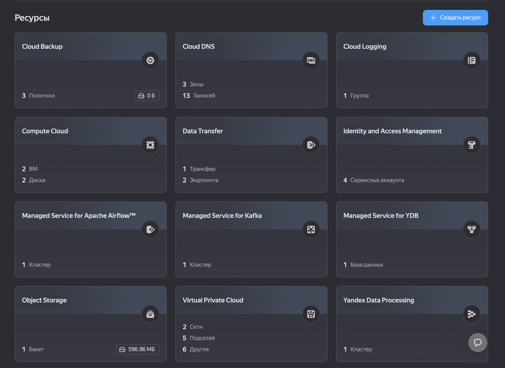

*Общий вид созданных сервисов в Yandex Cloud.*

### Концептуальная схема пайплайна

```
                                                          
[Колл-центр] ──→ YDB ──DataTransfer──→ Object Storage ───────────┐
                                                          
[Отделения/партнёры] ──→ CSV ──Airflow+Spark──→ Object Storage ──┤──→ DataLens (дашборды)
                                                          
[Digital-каналы] ──→ Kafka ──Spark Streaming──→ Object Storage ──┘
```

**Пояснение:**
- **Задание 1** — данные колл-центра (transactions_v2) из YDB в Object Storage через Data Transfer
- **Задание 2** — данные отделений/партнёров (credit_applications.csv) обрабатываются PySpark через Airflow, сохраняются в Object Storage с агрегациями
- **Задание 3** — данные digital-каналов поступают через Kafka, обрабатываются Spark Streaming (flatten JSON) и сохраняются в Object Storage
- **Задание 4** — все три потока объединяются в DataLens для построения единого дашборда

---

## 5. Задание 1: YDB → Object Storage

### Что сделано

- Создан **Yandex Managed YDB** (бессерверная БД)
- В YDB загружен файл `credit_applications.csv` через ydb CLI
- Настроен **Data Transfer: эндпоинт-источник YDB** → **эндпоинт-приёмник Object Storage**
- Трансфер перенёс данные в бакет `petr-bondarev-module4-task1` в папку `2026/06/13/transactions_v2/`

### Terraform

```hcl
# task1-terraform/ydb-to-object-storage.tf
```

### Результат

- Объём перенесённых данных: **22.5 MiB** (файл `part-*.json`, формата NDJSON)
- Формат: каждая строка — JSON-объект с полями колл-центра

### Скриншоты

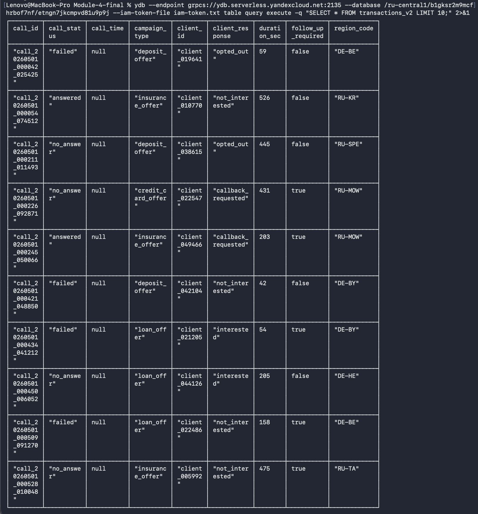
*YDB — созданная таблица и загруженные данные*

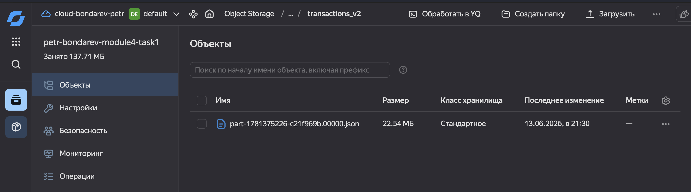
*Object Storage — бакет с перенесёнными файлами*

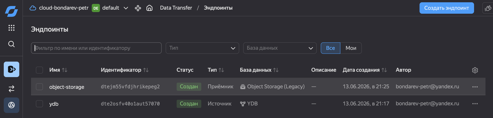
*Data Transfer — эндпоинт-источник (YDB) и эндпоинт-приёмник (Object Storage)*

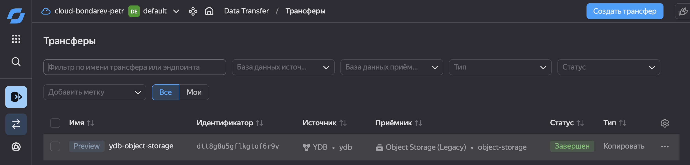
*Data Transfer — статус трансфера: DONE*

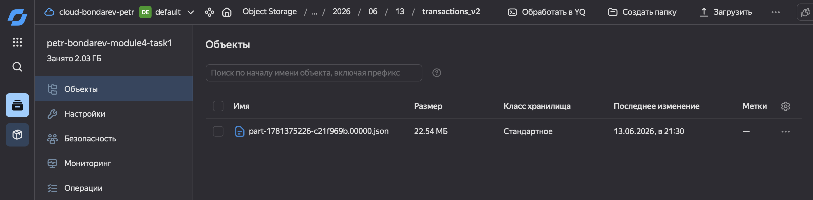
*Object Storage — файлы transactions_v2 в бакете после трансфера*

---

## 6. Задание 2: Airflow + PySpark-обработка

### Что сделано

1. Создан кластер **Yandex Managed Airflow v2.10** (1 web, 1 scheduler, 1 worker)
2. Написан DAG `ETL_SPARK_PROCESSING` ([`Data-Processing-DAG.py`](Data-Processing-DAG.py)):
   - BashOperator: curl → REST API Data Proc → отправка PySpark-задания
   - Fire-and-forget: только отправка, без ожидания завершения
   - Использует IAM-токен из metadata service
3. PySpark-скрипт [`process-csv-for-task2.py`](process-csv-for-task2.py) выполняет:
   - Чтение `credit_applications.csv` из Object Storage
   - Добавление колонок `year`, `month`, `day`
   - **Агрегации:**
     - `daily_stats`: заявки по дням и каналам
     - `risk_analytics`: статистика по risk_level
     - `channel_stats`: канал × decision_status
   - Сохранение в Parquet и CSV (без сжатия)

### Результат

| Файл | Формат | Размер |
|---|---|---|
| `processed/credit_applications.parquet/` | Parquet (snappy) | 14.9 MiB |
| `processed/task2/daily_stats/` | CSV | 20 KiB |
| `processed/task2/risk_analytics/` | CSV | 185 B |
| `processed/task2/channel_stats/` | CSV | 480 B |

### Скриншоты

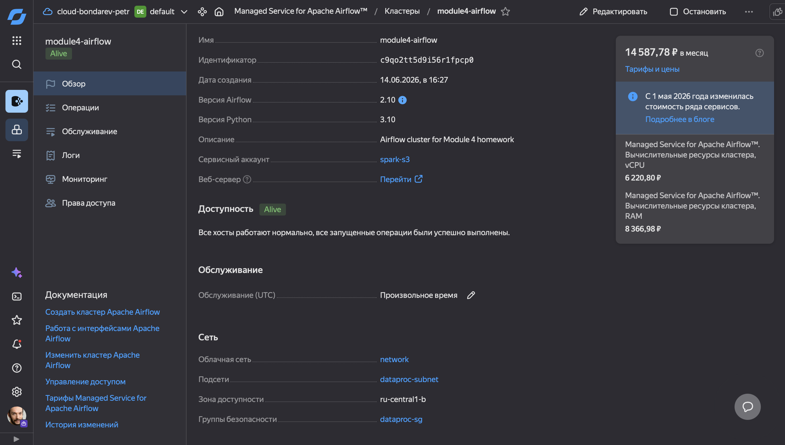
*Managed Airflow — страница кластера в Yandex Cloud*

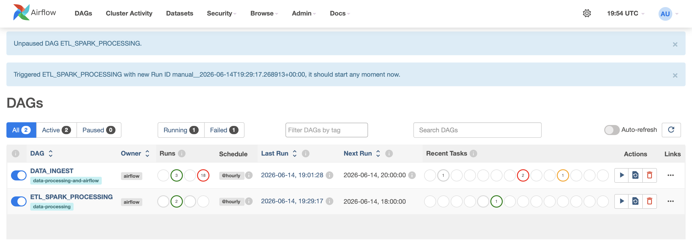
*Airflow WebUI — список DAG, виден ETL_SPARK_PROCESSING*

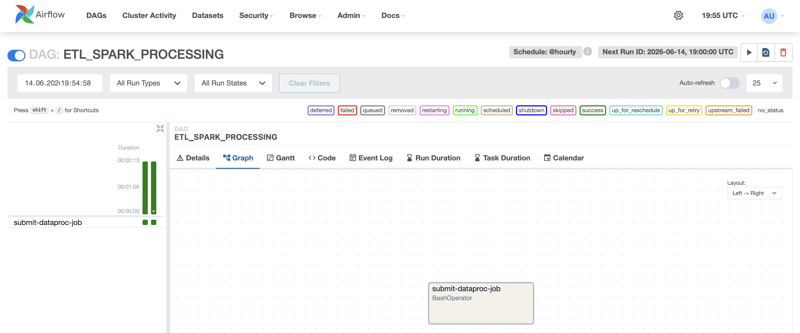
*Airflow WebUI — граф DAG с задачей submit-dataproc-job*

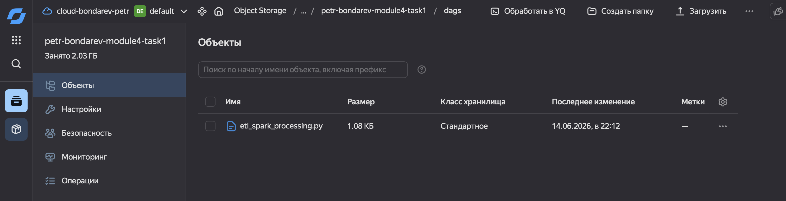
*Object Storage — DAG-файлы в папке dags/*

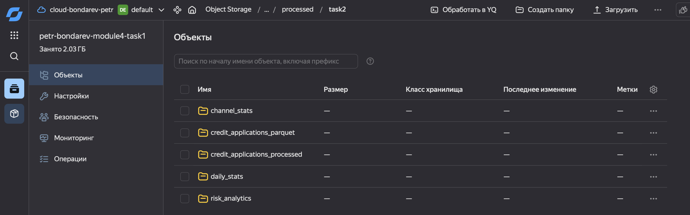
*Object Storage — папка processed/ с результатами PySpark*

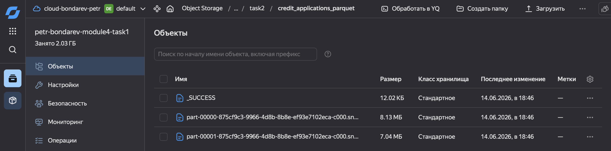
*Object Storage — credit_applications.parquet в бакете*

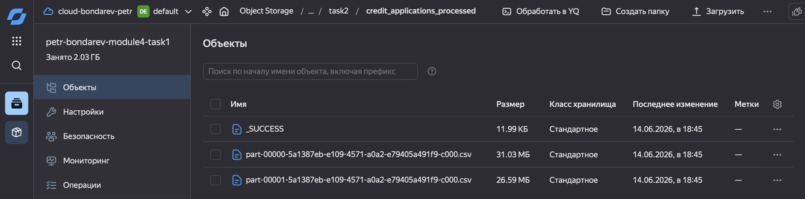
*Object Storage — credit_applications.csv в бакете*

---

## 7. Задание 3: Kafka + PySpark (потоковая обработка)

### Что сделано

1. Создан кластер **Yandex Managed Kafka** (топик `dataproc-kafka-topic`)
2. Создан кластер **Yandex Data Processing** (Spark 3.x)
3. Написан PySpark-скрипт [`kafka-full-pipeline.py`](kafka-full-pipeline.py):

**Шаг 1 — Запись в Kafka:**
- Чтение `credit_applications.csv` из Object Storage (440 000 строк, 55 MB)
- Конвертация каждой строки в JSON-сообщение
- Отправка в топик `dataproc-kafka-topic`

**Шаг 2 — Batch чтение + flatten JSON:**
- Чтение всех сообщений из Kafka (`startingOffsets=earliest`, `endingOffsets=latest`)
- Парсинг JSON-строк через `from_json()` по заданной схеме
- Получение плоской таблицы: 14 колонок, 440 000 строк
- Сохранение в Parquet и CSV

**Шаг 3 — Streaming чтение + flatten JSON:**
- Чтение из Kafka в режиме `readStream` с `trigger(processingTime="30 seconds")`
- Аналогичный flatten JSON → Parquet

### Результат

| Папка | Формат | Размер | Описание |
|---|---|---|---|
| `kafka-read-batch-output/csv/` | CSV (с заголовками) | 267.8 MiB | Плоская таблица, 440K строк |
| `kafka-read-batch-output/parquet/` | Parquet (snappy) | 70.6 MiB | Колоночный формат |
| `kafka-read-stream-output/parquet/` | Parquet (snappy) | 33 MiB (2 батча) | Streaming-результат |

> **Примечание:** в ходе работы потребовалось переписать скрипт — исходно JSON из Kafka сохранялся как текстовые строки (`.txt`), не разложенные по колонкам. После замены `format("text")` на `from_json() → flatten → to_json()` выходные данные стали плоской таблицей.

### Скриншоты

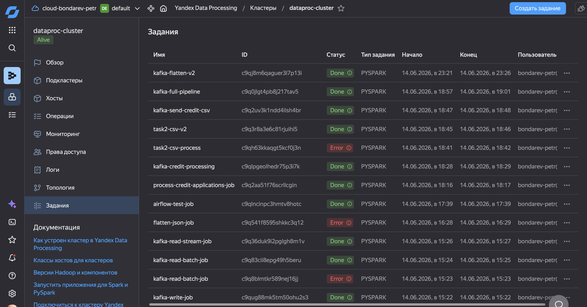
*Data Processing — список выполненных PySpark-заданий*

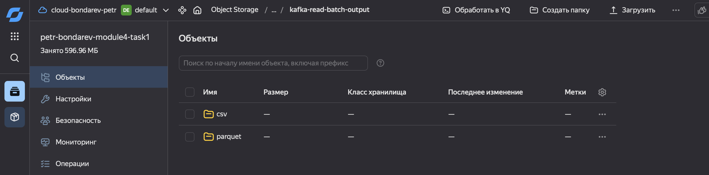
*Object Storage — результаты batch-чтения из Kafka*

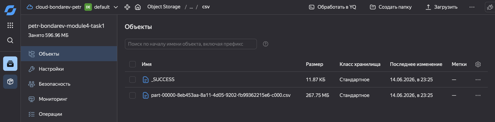
*Object Storage — плоская таблица в CSV после flatten JSON*

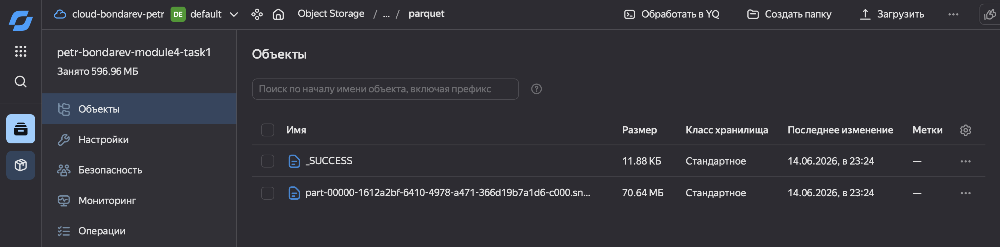
*Object Storage — плоская таблица в Parquet (70.6 MiB)*


*Object Storage — результаты стримингового чтения из Kafka*

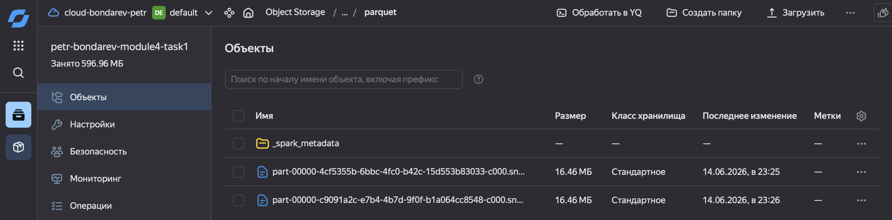
*Object Storage — streaming-результаты в Parquet (33 MiB)*

---

## 8. Задание 4: DataLens — визуализация

### Что сделано

1. Файлы из Object Storage скачаны локально в `object-storage-download/`
2. `credit_applications.parquet` и `transactions_v2.ndjson` конвертированы в CSV (DataLens не поддерживает Parquet/NDJSON напрямую)
3. Добавлен справочник `region_coords.csv` (координаты 10 регионов для карты)
4. Все 5 CSV-файлов загружены в DataLens через коннектор **«Файлы»**

### Датасеты

| Файл | Строк | Колонок | Назначение |
|---|---|---|---|
| `credit_applications.csv` | 440 000 | 14 | Кредитные заявки (основная таблица) |
| `transactions_v2.csv` | 96 500 | 9 | Звонки колл-центра (сквозная аналитика) |
| `daily_stats/part-*.csv` | ~930 | 7 | Агрегация по дням |
| `risk_analytics/part-*.csv` | 3 | 4 | Статистика по уровням риска |
| `channel_stats/part-*.csv` | 15 | 4 | Статистика канал × решение |
| `region_coords.csv` | 10 | 4 | Координаты регионов |

### Чарты на дашборде

| № | Тип | Датасет | Показатели |
|---|---|---|---|
| 1 | Pie | `credit_applications` | Распределение заявок по `product_type` |
| 2 | Bar | `credit_applications` | Сумма одобренных средств по каналам |
| 3 | Line | `daily_stats` | Динамика заявок по дням с разбивкой по каналам |
| 4 | Bar | `credit_applications` | Средний credit_score по risk_level |
| 5 | Map | `credit_applications` + `region_coords` | Гео-распределение заявок по регионам |
| 6 | Bar | `transactions_v2` | Ответы клиентов по типам кампаний |

### Скриншот дашборда

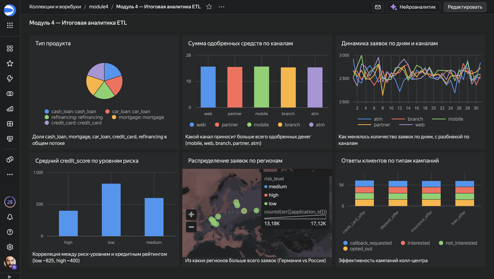

---

## 9. Заключение

### Результаты

| Задание | Сервисы | Объём данных | Статус |
|---|---|---|---|
| 1. YDB → Object Storage | YDB, Data Transfer, Object Storage | 22.5 MiB | ✅ |
| 2. Airflow + PySpark | Managed Airflow, Data Proc, Object Storage | 14.9 MiB (Parquet) + 267.8 MiB (CSV) | ✅ |
| 3. Kafka + PySpark | Managed Kafka, Data Proc, Object Storage | 70.6 MiB (Parquet) + 267.8 MiB (CSV) | ✅ |
| 4. DataLens | DataLens | 5 датасетов, 6 чартов | ✅ |

### Выводы

- **Terraform** успешно применён для развёртывания YDB, Data Proc, Kafka и Airflow
- **PySpark** на Data Proc эффективно обрабатывает 440K записей (~55 MB) за 5–10 минут
- **Airflow** с BashOperator + REST API Data Proc — минималистичный и рабочий подход к оркестрации
- **Kafka** как message broker добавляет потоковую обработку поверх batch-пайплайна
- **DataLens** через коннектор «Файлы» — простой способ визуализации без развёртывания БД

### Затраченные облачные ресурсы

- Yandex Managed YDB (serverless)
- Yandex Object Storage
- Yandex Data Transfer
- Yandex Managed Airflow (1 web, 1 scheduler, 1 worker, c1-m4)
- Yandex Data Processing (1 master + 2 worker nodes)
- Yandex Managed Kafka (3 брокера)

Все ресурсы удалены после завершения работы. Данные и скриншоты сохранены локально.